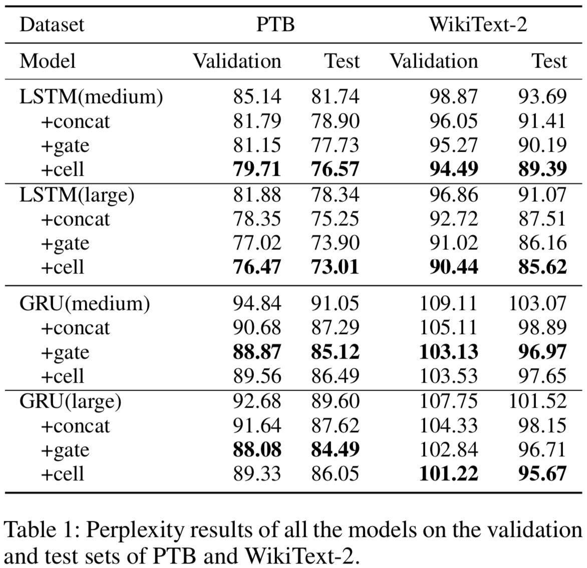

# Enhancing Recurrent Neural Networks with Sememes
If you have any question, feel free to contact us: qinyj16@mails.tsinghua.edu.cn, scouyang4354@gmail.com

## Sememe Dataset
sememe.txt include all 2186 sememe. hownet_en.txt is an English version HowNet while each line of word is followed by a line of all its sememes. More Details about HowNet could be found in paper.

## Language model

For language model, you could run by:

```
cd LM
CUDA_VISIBLE_DEVICES=3 python main.py --cuda --emsize 1500 --nhid 1500  --epochs 40 --sememe_dim 1500 --model_type LSTM_cell --dropout 0.7
```
The default command is for LSTM+cell, if you want to test other models, you could replace corresponding command.

## Sentence encoders (pretrained on SNLI, transfered to downstream tasks)

First please download the pretrained glove embeddings, which can be achieved through: https://nlp.stanford.edu/projects/glove/ 

Then you could easily train on SNLI Dataset by:

```
python3 train_nli.py --word_emb_path ../glove/glove.840B.300d.txt --encoder_type LSTM_extra_cell --gpu_id 2
```

All the models mentioned in paper are included in models.py. Check the name of the encoder and notice that you have to change the parameter --encoder_type.


You could also test the result on other transfer task by(not report in current paper):

```
python3 transfer.py --encoder_type LSTM_extra_cell 
```
model path(pkl file) should have been modified before you run.


Notice that all of our models on GTX1080Ti.




